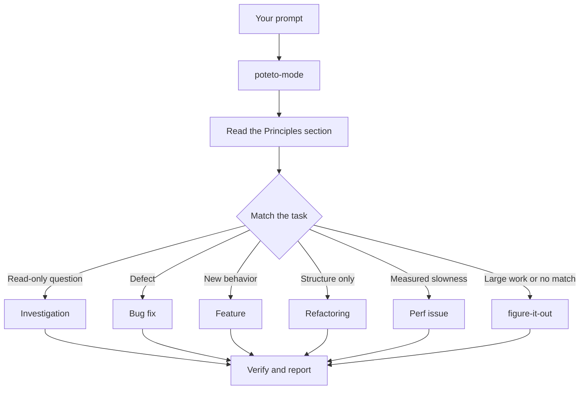

# Route work through `/poteto-mode`

`/poteto-mode` is the front door. You give it a goal, it reads the matching playbook, copies its steps into a visible checklist using native task tools or a Markdown plan file, and calls the other skills as the steps need them. This page shows what a good prompt looks like, and how little of one you need.


## What happens to your prompt



The diagram shows the common routes. The [playbook directory](../../skills/poteto-mode/playbooks/) holds all 23. The rest cover hillclimbing a metric, runtime and trace forensics, prototypes, visual parity, authoring and evaluating skills, autonomous runs, babysitting a PR to merge-ready, shipping a verified stack, autopilot over a PR queue, orchestrating a program, session pickup, pausing safely, multi-phase plans, and worktree cleanup.

## Say the goal, not the ceremony

You don't write a spec. You say what's wrong or what you want, plus anything you already know that saves the agent time:

```text
/poteto-mode users get two notifications after a retry. repro first, then fix and verify.
```

That's a Bug fix prompt. "repro first" is a real constraint, not politeness, and the playbook honors it. The agent reads the Bug fix playbook and copies its steps into a visible checklist. If the host has no task or planning tool, the checklist lives in a Markdown plan file linked from progress messages. A skipped step stays visible with `skip: <reason>`.

When the conversation already carries the context, the prompt shrinks to almost nothing. All of these are enough:

```text
/poteto-mode do it
```

```text
continue
```

```text
keep going until done
```

A short prompt works because `/poteto-mode` stays active across turns and the playbook already lists the steps. Your words carry the intent, and the skill carries the rigor.

## Switch tasks with "new task"

A long chat accumulates context from the last task. When you change subjects, say so:

```text
/poteto-mode new task. figure out why the cache entry survives logout. don't change any code yet.
```

"new task" tells `/poteto-mode` to re-match rather than continue the prior playbook. "don't change any code yet" pins this one to Investigation. Without those two phrases, an agent partway through the Feature playbook tends to treat your question as the next feature step.

## Give parallel work its own worktree

If you run several agents against one repository, they overwrite each other's files in the working tree. Ask for isolation up front:

```text
/poteto-mode new task. branch off <base> in a fresh worktree, then port the parser change there.
```

Each task in its own branch and worktree means no agent touches another's files. The [Opening a PR playbook](../../skills/poteto-mode/playbooks/opening-a-pr.md) already works from a worktree for code changes, so you say this only when a specific base or location matters.

Worktrees accumulate. When disk gets tight, ask:

```text
/poteto-mode what's eating my disk? prune the worktrees that are safe to prune.
```

The [Worktree cleanup playbook](../../skills/poteto-mode/playbooks/worktree-cleanup.md) classifies every worktree by merge state, uncommitted work, and which chats still touch it. It deletes only what that evidence clears. It asks you before touching a worktree that holds uncommitted work.

## Leave it running

When you step away, say what done means and go:

```text
/poteto-mode im stepping away. keep going until the migration check reports zero old callers. log your decisions.
```

Work you'll review later routes through [`/figure-it-out`](../../skills/figure-it-out/SKILL.md), which designs the run's phases and keeps a [`/show-me-your-work`](../../skills/show-me-your-work/SKILL.md) decision log. [Run work while you sleep](./07-overnight.md) covers the full overnight contract.

**Pitfall:** don't enumerate skills in your prompt ("use /how, then /architect, then /arena..."). The playbook already sequences them, and a hand-written sequence usually reorders or drops steps the playbook would have kept. Name a skill only when you want to override a specific choice.

Read [`poteto-mode`](../../skills/poteto-mode/SKILL.md) itself for the full routing rules.

Next: [Understand the code](./03-understand.md).
